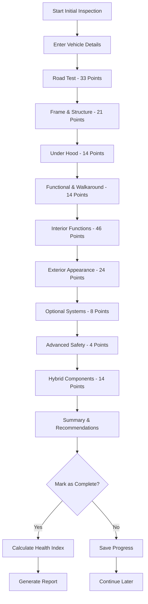

# Initial Inspections System Documentation

## Overview

The Initial Inspections System is a comprehensive 160-point pre-purchase vehicle assessment tool designed to provide detailed evaluations of second-hand vehicles. This system helps buyers make informed decisions by identifying potential issues, estimating repair costs, and providing purchase recommendations.

## Table of Contents

1. [System Architecture](#system-architecture)
2. [Inspection Process](#inspection-process)
3. [160-Point Checklist](#160-point-checklist)
4. [Health Index Calculation](#health-index-calculation)
5. [User Interface](#user-interface)
6. [API Endpoints](#api-endpoints)
7. [Database Schema](#database-schema)
8. [Integration Points](#integration-points)
9. [Best Practices](#best-practices)
10. [Troubleshooting](#troubleshooting)

## System Architecture

### Core Components

- **InitialInspection Model**: Django model storing all inspection data
- **InitialInspectionForm**: Django form handling 160+ inspection fields
- **Health Index Calculator**: Utility functions for scoring vehicle condition
- **Template System**: Professional UI for inspection creation and viewing
- **Integration Layer**: Connects with vehicle search and reporting systems

### Key Files

```
maintenance_history/
├── models.py              # InitialInspection model definition
├── forms.py               # InitialInspectionForm with all 160+ fields
├── views.py               # CRUD operations for initial inspections
├── utils.py               # Health index calculation algorithms
└── urls.py                # URL routing for inspection endpoints

templates/maintenance/
├── create_initial_inspection_form.html    # Main inspection form
├── initial_inspection_list.html           # List view
├── initial_inspection_detail.html         # Detail view
└── update_initial_inspection_form.html    # Edit form

Docs/
└── Initial_Inspections_System.md          # This documentation
```

## Inspection Process

### 1. Inspection Creation

**Access Point**: Technician Dashboard → "Initial Inspection" button

**Process Flow**:
1. Technician clicks "Initial Inspection" (160-point pre-purchase)
2. System opens comprehensive inspection form
3. Technician fills out vehicle details and inspection points
4. Real-time progress tracking shows completion percentage
5. System validates required fields and critical safety systems
6. Upon completion, health index is automatically calculated

### 2. Inspection Workflow



## 160-Point Checklist

### Section Breakdown

| Section | Points | Description |
|---------|--------|-------------|
| **Road Test** | 33 | Engine performance, transmission, steering, brakes, HVAC |
| **Frame & Structure** | 21 | Structural integrity, suspension, underbody components |
| **Under Hood** | 14 | Engine bay, fluids, electrical systems, battery |
| **Functional & Walkaround** | 14 | Lights, gauges, exterior functionality |
| **Interior Functions** | 46 | Controls, electronics, comfort features, spare tire |
| **Exterior Appearance** | 24 | Paint, body condition, cleanliness, cosmetics |
| **Optional Systems** | 8 | Sunroof, navigation, 4WD, truck bed features |
| **Advanced Safety** | 4 | Driver assistance, collision avoidance systems |
| **Hybrid Components** | 14 | Electric motor, battery, power management |
| **Assessment** | - | Overall rating, repair costs, recommendations |

### Critical Safety Systems

The following systems are weighted heavily in the health index calculation:

- **Braking System**: Brake pads, rotors, fluid, ABS operation
- **Steering System**: Response, alignment, power steering
- **Tire Condition**: Tread depth, pressure, specifications
- **Safety Equipment**: Seat belts, airbags, lights
- **Structural Integrity**: Frame, suspension, alignment

## Health Index Calculation

### Scoring Algorithm

The health index uses a weighted scoring system:

```python
# Field Weight Categories
critical_systems = {     # Weight: 10-12 points
    'brake_vibrations': 12,
    'steering_feel': 12,
    'tire_condition': 11,
    # ... more critical fields
}

important_systems = {    # Weight: 6-9 points
    'engine_operation': 8,
    'transmission': 9,
    # ... more important fields
}

standard_systems = {     # Weight: 3-5 points
    'interior_features': 4,
    'appearance': 3,
    # ... more standard fields
}
```

### Health Index Categories

| Score Range | Category | Description |
|-------------|----------|-------------|
| 90-100% | **Excellent** | Outstanding condition, minimal issues |
| 80-89% | **Good** | Minor issues, routine maintenance needed |
| 70-79% | **Fair** | Some concerns, moderate repairs required |
| 60-69% | **Poor** | Multiple issues, significant repairs needed |
| <60% | **Critical** | Major problems, extensive repairs required |

### Inspection Results

Based on health index and critical failures:

- **PAS** (Passed): No critical issues, high health score
- **PMD** (Passed with Minor Defects): Minor issues only
- **PJD** (Passed with Major Defects): Some major issues but acceptable
- **FMD** (Failed Minor Defects): Too many minor issues
- **FJD** (Failed Major Defects): Critical system failures
- **FAI** (Failed): Unsafe vehicle, do not purchase

## User Interface

### Technician Dashboard Integration

```html
<!-- Quick Action Card -->
<a href="">
    <div class="inspection-card">
        <h3>Initial Inspection</h3>
        <p>160-point pre-purchase</p>
    </div>
</a>

<!-- Statistics Card -->
<div class="stats-card">
    <h4>Initial Inspections</h4>
    <span>{{ total_initial_inspections|default:0 }}</span>
    <p>160-point checks</p>
</div>
```

### Form Features

- **Progress Tracking**: Real-time completion percentage
- **Section Organization**: Logical grouping of inspection points
- **Field Validation**: Required fields and data validation
- **Notes Sections**: Detailed observations for each category
- **Responsive Design**: Works on desktop and mobile devices
- **Auto-save Ready**: JavaScript structure supports auto-save

### Search Results Integration

Initial inspections appear in vehicle search results:

```html
<!-- Initial Inspections Section -->

<div class="initial-inspections-section">
    <h3>Initial Vehicle Inspections</h3>
    <p>Comprehensive 160-point pre-purchase inspections</p>
    
    
    <div class="inspection-card">
        <h4>{{ inspection.inspection_number }}</h4>
        <p>{{ inspection.inspection_date|date:"M j, Y" }}</p>
        <div class="progress-bar">
            {{ inspection.completion_percentage }}% Complete
        </div>
        <button onclick="openInitialInspectionModal('{{ inspection.id }}')">
            View Details
        </button>
    </div>
    
</div>

```

## API Endpoints

### URL Patterns

```python
# maintenance_history/urls.py
urlpatterns = [
    # Initial Inspection URLs
    path('initial-inspections/', 
         views.InitialInspectionListView.as_view(), 
         name='initial_inspection_list'),
    path('initial-inspections/<int:pk>/', 
         views.InitialInspectionDetailView.as_view(), 
         name='initial_inspection_detail'),
    path('initial-inspections/create/', 
         views.CreateInitialInspectionView.as_view(), 
         name='create_initial_inspection'),
    path('initial-inspections/<int:pk>/update/', 
         views.UpdateInitialInspectionView.as_view(), 
         name='update_initial_inspection'),
]
```

### View Classes

```python
class CreateInitialInspectionView(LoginRequiredMixin, CreateView):
    model = InitialInspection
    form_class = InitialInspectionForm
    template_name = 'maintenance/create_initial_inspection_form.html'
    
    def form_valid(self, form):
        # Set technician and handle completion
        if not form.instance.technician:
            form.instance.technician = self.request.user
        
        initial_inspection = form.save()
        
        # Auto-calculate health index if completed
        if initial_inspection.is_completed:
            initial_inspection._update_calculated_fields()
        
        return super().form_valid(form)
```

## Database Schema

### InitialInspection Model

```python
class InitialInspection(models.Model):
    # Basic Information
    vehicle = models.ForeignKey(Vehicle, related_name='initial_inspections')
    inspection_number = models.CharField(max_length=20, unique=True)
    technician = models.ForeignKey(User, related_name='initial_inspections')
    inspection_date = models.DateTimeField(default=timezone.now)
    mileage_at_inspection = models.PositiveIntegerField()
    
    # Road Test (33 fields)
    cold_engine_operation = models.CharField(max_length=15, choices=STATUS_CHOICES)
    throttle_operation = models.CharField(max_length=15, choices=STATUS_CHOICES)
    # ... 31 more road test fields
    
    # Frame & Structure (21 fields)
    frame_unibody_condition = models.CharField(max_length=15, choices=STATUS_CHOICES)
    panel_alignment = models.CharField(max_length=15, choices=STATUS_CHOICES)
    # ... 19 more structure fields
    
    # ... Additional sections (Under Hood, Functional, Interior, etc.)
    
    # Assessment Fields
    overall_condition_rating = models.CharField(max_length=20, choices=CONDITION_CHOICES)
    overall_notes = models.TextField(blank=True)
    recommendations = models.TextField(blank=True)
    estimated_repair_cost = models.DecimalField(max_digits=10, decimal_places=2)
    
    # Completion Tracking
    is_completed = models.BooleanField(default=False)
    completed_at = models.DateTimeField(null=True, blank=True)
    
    # Timestamps
    created_at = models.DateTimeField(auto_now_add=True)
    updated_at = models.DateTimeField(auto_now=True)
```

### Status Choices

```python
STATUS_CHOICES = [
    ('pass', 'Pass'),
    ('fail', 'Fail'),
    ('na', 'Not Applicable'),
    ('minor', 'Minor Issue'),
    ('major', 'Major Issue'),
    ('needs_attention', 'Needs Attention'),
]
```

## Integration Points

### Vehicle Search Integration

Initial inspections are automatically included in vehicle search results:

```python
# users/views.py - search_results function
def search_results(request):
    # ... existing code ...
    
    # Get initial inspections
    initial_inspections = InitialInspection.objects.filter(
        vehicle=vehicle
    ).select_related('technician').order_by('-inspection_date')
    
    context.update({
        'initial_inspections': initial_inspections,
        # ... other context
    })
```

### Dashboard Statistics

```python
# maintenance_history/views.py - TechnicianDashboardView
def get_context_data(self, **kwargs):
    # ... existing code ...
    
    # Get initial inspection statistics
    user_initial_inspections = InitialInspection.objects.filter(
        technician=self.request.user
    )
    context['total_initial_inspections'] = user_initial_inspections.count()
    context['pending_initial_inspections'] = user_initial_inspections.filter(
        is_completed=False
    ).count()
```

### Health Index Utilities

```python
# maintenance_history/utils.py
def calculate_initial_inspection_health_index(inspection):
    """Calculate health index for 160-point inspection"""
    field_weights = get_initial_inspection_field_weights()
    # ... calculation logic ...
    return health_index, inspection_result

def get_initial_inspection_recommendations(inspection):
    """Generate purchase recommendations"""
    # ... recommendation logic ...
    return recommendations_list
```

## Best Practices

### For Technicians

1. **Complete Inspections Systematically**
   - Follow the section order (Road Test → Structure → Under Hood → etc.)
   - Don't skip critical safety systems
   - Use detailed notes for any issues found

2. **Accurate Assessment**
   - Be honest about vehicle condition
   - Document specific problems clearly
   - Include repair cost estimates when possible

3. **Progress Management**
   - Save progress regularly
   - Aim for at least 80% completion before marking as complete
   - Review all entries before final submission

### For Developers

1. **Form Validation**
   - Ensure critical safety systems are inspected
   - Validate completion percentage before allowing submission
   - Handle edge cases gracefully

2. **Performance Optimization**
   - Use select_related for database queries
   - Implement auto-save functionality
   - Optimize form rendering for large field count

3. **User Experience**
   - Provide clear progress indicators
   - Use consistent styling across sections
   - Implement responsive design for mobile use

## Troubleshooting

### Common Issues

**Issue**: Health index not calculating
- **Cause**: Inspection not marked as completed
- **Solution**: Ensure `is_completed=True` and save the model

**Issue**: Form validation errors
- **Cause**: Missing required fields or invalid data
- **Solution**: Check field validation rules and ensure all required fields are filled

**Issue**: Progress tracking incorrect
- **Cause**: JavaScript not counting all form fields
- **Solution**: Verify field selectors in JavaScript match form structure

**Issue**: Template rendering slowly
- **Cause**: Large number of form fields
- **Solution**: Consider implementing progressive loading or section-based rendering

### Debug Commands

```python
# Check inspection completion
inspection = InitialInspection.objects.get(id=1)
print(f"Completion: {inspection.completion_percentage}%")
print(f"Failed points: {len(inspection.failed_points)}")

# Recalculate health index
inspection._update_calculated_fields()

# View field weights
from maintenance_history.utils import get_initial_inspection_field_weights
weights = get_initial_inspection_field_weights()
print(f"Critical systems: {len(weights['critical'])}")
```

### Performance Monitoring

```python
# Monitor inspection creation time
import time
start_time = time.time()
inspection = InitialInspection.objects.create(...)
end_time = time.time()
print(f"Creation time: {end_time - start_time:.2f} seconds")

# Check database query count
from django.db import connection
print(f"Queries executed: {len(connection.queries)}")
```

## Future Enhancements

### Planned Features

1. **PDF Report Generation**
   - Automated report creation upon completion
   - Professional formatting with charts and recommendations
   - Email delivery to stakeholders

2. **Mobile App Integration**
   - Native mobile app for field inspections
   - Offline capability with sync
   - Photo capture and annotation

3. **AI-Powered Recommendations**
   - Machine learning for repair cost estimation
   - Predictive maintenance suggestions
   - Market value assessment integration

4. **Advanced Analytics**
   - Inspection trend analysis
   - Technician performance metrics
   - Vehicle reliability scoring

### Technical Improvements

1. **Auto-save Functionality**
   - Periodic form data saving
   - Recovery from browser crashes
   - Conflict resolution for concurrent edits

2. **Enhanced Validation**
   - Real-time field validation
   - Cross-field dependency checks
   - Smart completion suggestions

3. **Performance Optimization**
   - Form field lazy loading
   - Database query optimization
   - Caching for frequently accessed data

---

## Support

For technical support or questions about the Initial Inspections System:

- **Documentation**: This file and related docs in `/Docs/` folder
- **Code Issues**: Check model definitions and utility functions
- **UI Problems**: Review template files and JavaScript functionality
- **Database Issues**: Examine model relationships and migrations

**Last Updated**: December 2024
**Version**: 1.0
**Maintainer**: Development Team