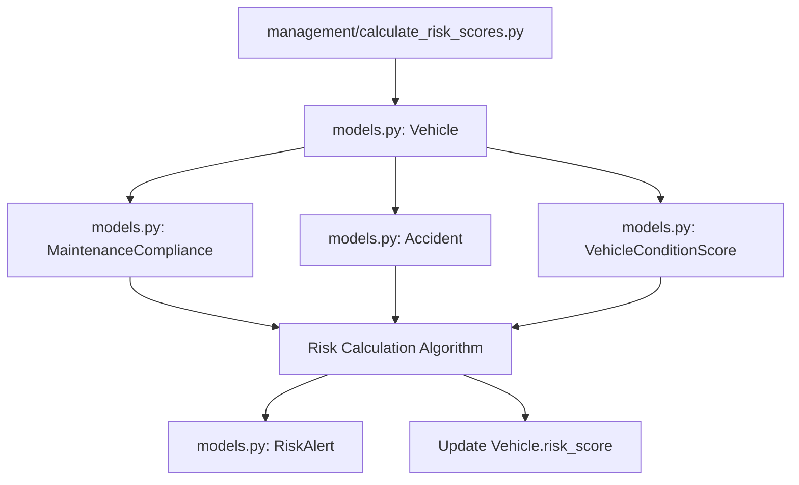

# Insurance Risk Assessment Platform - Implementation Guide

## Table of Contents
- [Architecture Overview](#architecture-overview)
- [File Structure and Dependencies](#file-structure-and-dependencies)
- [Data Flow and Connections](#data-flow-and-connections)
- [Component Interactions](#component-interactions)
- [API Integration Patterns](#api-integration-patterns)
- [Background Processing Pipeline](#background-processing-pipeline)
- [Frontend-Backend Communication](#frontend-backend-communication)

## Architecture Overview

This Django-based insurance risk assessment platform implements a comprehensive system for tracking vehicle maintenance compliance, condition scoring, accident correlation, and high-risk vehicle identification. The architecture follows Django's Model-View-Template (MVT) pattern enhanced with REST API capabilities.

```
┌─────────────────┐    ┌─────────────────┐    ┌─────────────────┐
│   Frontend      │    │   Backend       │    │   Background    │
│   Dashboard     │◄──►│   Django API    │◄──►│   Processing    │
│                 │    │                 │    │                 │
│ - Tailwind CSS  │    │ - Models        │    │ - Celery Tasks  │
│ - Chart.js      │    │ - Views         │    │ - Management    │
│ - React (opt)   │    │ - Serializers   │    │   Commands      │
└─────────────────┘    └─────────────────┘    └─────────────────┘
         │                        │                        │
         └────────────────────────┼────────────────────────┘
                                  │
                        ┌─────────▼─────────┐
                        │    Database       │
                        │   PostgreSQL      │
                        └───────────────────┘
```

## File Structure and Dependencies

### Core Django Files and Their Relationships

```
insurance_app/
├── models.py           # Database schema and business logic
├── views.py            # API endpoints and view logic
├── serializers.py      # REST API serialization
├── urls.py             # URL routing and API endpoints
├── tasks.py            # Background processing (Celery)
├── templates/
│   └── insurance/
│       ├── insurance_dashboard.html        # Main dashboard template
│       └── vehicle_detail.html   # Vehicle detail view
├── management/
│   └── commands/
│       ├── calculate_risk_scores.py
│       ├── update_compliance_scores.py
│       └── generate_risk_report.py
└── static/
    ├── css/
    └── js/
```

### Dependency Chain

```
models.py → serializers.py → views.py → urls.py → templates/
    ↓              ↓             ↓
tasks.py    management/    static files
             commands/
```

## Data Flow and Connections

### 1. Model Relationships (`models.py`)

The models create a hierarchical data structure with clear relationships:

```python
# Primary relationship chain
InsurancePolicy (1) ──→ (n) Vehicle (1) ──→ (n) MaintenanceSchedule
                                     │
                                     ├──→ (1) MaintenanceCompliance
                                     ├──→ (n) VehicleConditionScore
                                     ├──→ (n) Accident
                                     └──→ (n) RiskAlert

# Aggregation model
RiskAssessmentMetrics ──→ InsurancePolicy
```

**Key Connections:**
- `Vehicle.policy` → `InsurancePolicy` (Foreign Key)
- `MaintenanceSchedule.vehicle` → `Vehicle` (Foreign Key)
- `MaintenanceCompliance.vehicle` → `Vehicle` (One-to-One)
- `RiskAlert.vehicle` → `Vehicle` (Foreign Key)

### 2. Serializer Dependencies (`serializers.py`)

Serializers create JSON representations and handle nested relationships:

```python
VehicleSerializer:
├── includes → MaintenanceScheduleSerializer (many=True)
├── includes → MaintenanceComplianceSerializer
├── includes → latest_condition_score (SerializerMethodField)
└── includes → active_alerts_count (calculated field)
```

**Connection Pattern:**
```
models.py → serializers.py
    ↓            ↓
Business Logic → API Data Structure
```

### 3. View Layer Connections (`views.py`)

Views orchestrate data flow between models, serializers, and API responses:

```python
# Class-based views connect to models
DashboardView → InsurancePolicy, Vehicle, MaintenanceCompliance
VehicleDetailView → Vehicle + related objects

# API ViewSets use serializers
VehicleViewSet → VehicleSerializer → Vehicle model
MaintenanceComplianceViewSet → MaintenanceComplianceSerializer

# Function-based views aggregate data
calculate_portfolio_metrics() → Multiple models → JSON response
```

**Data Flow in Views:**
```
HTTP Request → View → Model Query → Serializer → JSON Response
              ↓
         Business Logic
```

## Component Interactions

### 1. Risk Score Calculation Pipeline

The risk assessment system involves multiple file interactions:



**File Connections:**
1. **Management Command** (`calculate_risk_scores.py`) triggers the process
2. **Models** (`models.py`) provide data and business logic
3. **Tasks** (`tasks.py`) can run this automatically via Celery
4. **Views** (`views.py`) expose risk data via API
5. **Frontend** displays updated risk scores

### 2. Maintenance Compliance Flow

```python
# models.py - Business logic
class MaintenanceCompliance:
    def calculate_compliance(self):
        # Calculates compliance rates from maintenance schedules
        
# management/commands/update_compliance_scores.py
# Bulk updates all compliance scores

# views.py - API exposure
class MaintenanceComplianceViewSet:
    @action(detail=False)
    def portfolio_compliance(self):
        # Returns aggregated compliance data
        
# templates/dashboard.html - Display
# Shows compliance charts and metrics
```

### 3. Alert Generation System

The alert system connects multiple components:

```
Trigger Sources:
├── Risk Score Changes (calculate_risk_scores.py)
├── Overdue Maintenance (tasks.py: generate_maintenance_alerts)
├── Condition Deterioration (tasks.py: check_condition_deterioration)
└── Manual Triggers (views.py: API endpoints)
                    ↓
Alert Creation (models.py: RiskAlert)
                    ↓
API Exposure (views.py: RiskAlertViewSet)
                    ↓
Frontend Display (dashboard.html: alerts section)
```

## API Integration Patterns

### 1. RESTful Endpoint Structure (`urls.py`)

```python
# URL routing connects views to endpoints
urlpatterns = [
    # Dashboard views
    path('', DashboardView.as_view(), name='dashboard'),
    
    # API routes using Django REST framework router
    path('api/', include(router.urls)),
    
    # Custom API endpoints
    path('api/calculate-portfolio-metrics/', calculate_portfolio_metrics),
]

# Router connects ViewSets to URL patterns
router.register(r'vehicles', VehicleViewSet)
router.register(r'risk-alerts', RiskAlertViewSet)
```

### 2. API Data Flow

```
Frontend JavaScript → Django URLs → Views → Serializers → Models → Database
                                     ↓
Dashboard Updates ← JSON Response ← Business Logic ← Query Results
```

**Example API Call Chain:**
```javascript
// Frontend (dashboard.html)
fetch('/api/calculate-portfolio-metrics/')

// URLs (urls.py) 
→ path('api/calculate-portfolio-metrics/', calculate_portfolio_metrics)

// Views (views.py)
→ def calculate_portfolio_metrics(request):

// Models (models.py)
→ Vehicle.objects.filter(...).aggregate(...)

// Response
→ JsonResponse({'metrics': {...}})
```

### 3. Real-time Updates

The system implements real-time updates through multiple channels:

```python
# JavaScript polling (dashboard.html)
setInterval(() => fetchMetrics(), 30000)

# Background tasks (tasks.py)
@shared_task
def calculate_daily_risk_scores()

# Management commands (calculate_risk_scores.py)
# Can be called manually or via cron jobs
```

## Background Processing Pipeline

### 1. Celery Task Integration

```python
# tasks.py defines background jobs
@shared_task
def calculate_daily_risk_scores():
    call_command('calculate_risk_scores')
    
# Management commands perform actual work
# management/commands/calculate_risk_scores.py
class Command(BaseCommand):
    def handle(self):
        # Risk calculation logic
        
# Settings integrate Celery
CELERY_BEAT_SCHEDULE = {
    'calculate-daily-risk-scores': {
        'task': 'insurance.tasks.calculate_daily_risk_scores',
        'schedule': crontab(hour=2, minute=0),
    }
}
```

### 2. Processing Pipeline

```
Scheduled Time → Celery Beat → Task Queue → Worker Process → Management Command → Model Updates → Database
                                                                    ↓
Frontend Refresh ← API Response ← Views ← Updated Data ← Trigger Alerts ← Alert Generation
```

### 3. Command Dependencies

```python
# calculate_risk_scores.py
├── Reads from: Vehicle, MaintenanceCompliance, Accident, VehicleConditionScore
├── Updates: Vehicle.risk_score, Vehicle.vehicle_health_index
└── Creates: RiskAlert records

# update_compliance_scores.py
├── Reads from: MaintenanceSchedule
├── Updates: MaintenanceCompliance
└── Triggers: Risk score recalculation

# generate_risk_report.py
├── Reads from: All models
└── Outputs: CSV/JSON reports
```

## Frontend-Backend Communication

### 1. Template Integration

```html
<!-- dashboard.html -->
<script>
    // Connects to Django API endpoints
    fetch('/api/calculate-portfolio-metrics/')
    .then(response => response.json())
    .then(data => updateDashboard(data));
    
    // Uses data from Django context
    const vehicles = {{ vehicles|safe }};
</script>
```

### 2. React Component Integration (Optional)

```jsx
// React component can replace Django templates
const InsuranceRiskDashboard = () => {
    // Connects to same Django API endpoints
    useEffect(() => {
        fetch('/api/vehicles/')
        .then(response => response.json())
        .then(data => setVehicles(data));
    }, []);
};
```

### 3. Data Synchronization

```
Database Changes → Django Signals → Cache Invalidation → API Response Updates → Frontend Refresh
                      ↓
Background Tasks → Model Updates → WebSocket Notifications (optional) → Real-time Updates
```

## Implementation Flow Summary

### 1. Initial Setup Flow
```
1. Define models (models.py)
2. Create serializers (serializers.py)
3. Build views and API endpoints (views.py)
4. Configure URLs (urls.py)
5. Create templates (dashboard.html)
6. Setup background processing (tasks.py, management commands)
```

### 2. Runtime Data Flow
```
User Request → URL Routing → View Processing → Database Query → Business Logic → API Response → Frontend Update
                                                     ↓
Background Processing → Model Updates → Alert Generation → Cache Updates → Real-time Sync
```

### 3. Key Integration Points

| Component | Primary Connections | Purpose |
|-----------|-------------------|---------|
| `models.py` | All other components | Data structure and business logic |
| `views.py` | models.py, serializers.py, templates | API endpoints and view logic |
| `serializers.py` | models.py, views.py | Data transformation |
| `urls.py` | views.py | Request routing |
| `tasks.py` | models.py, management commands | Background processing |
| `templates/` | views.py, static files | User interface |
| `management/commands/` | models.py, tasks.py | Batch operations |

This interconnected architecture ensures that changes in one component properly propagate through the system, maintaining data consistency and providing real-time updates to users while handling complex risk assessment calculations in the background.