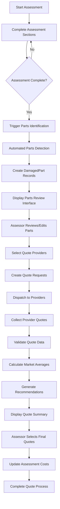

# Parts-Based Quote System - Complete Workflow Guide

## Overview

This guide explains the complete workflow of the Parts-Based Quote System from the initial vehicle assessment through to final quote recommendations and provider selection. The system transforms traditional hardcoded cost estimates into a dynamic, data-driven quote collection process.

## Table of Contents

1. [Workflow Overview](#workflow-overview)
2. [Phase 1: Assessment Creation & Completion](#phase-1-assessment-creation--completion)
3. [Phase 2: Automated Parts Identification](#phase-2-automated-parts-identification)
4. [Phase 3: Parts Review & Editing](#phase-3-parts-review--editing)
5. [Phase 4: Quote Request Dispatch](#phase-4-quote-request-dispatch)
6. [Phase 5: Quote Collection & Validation](#phase-5-quote-collection--validation)
7. [Phase 6: Market Analysis](#phase-6-market-analysis)
8. [Phase 7: Recommendation Generation](#phase-7-recommendation-generation)
9. [Phase 8: Quote Summary & Selection](#phase-8-quote-summary--selection)

## Workflow Overview



## Phase 1: Assessment Creation & Completion

### 1.1 Assessment Initialization

**Trigger**: Assessor creates new vehicle assessment

**Process**:
1. **Assessment Creation**:
   ```python
   # System automatically sets quote system flags
   assessment = VehicleAssessment.objects.create(
       vehicle=vehicle,
       assessor=user,
       uses_parts_based_quotes=True,  # Default for new assessments
       parts_identification_complete=False,
       quote_collection_status='not_started'
   )
   ```

2. **System Configuration Check**:
   - Verifies quote system is enabled
   - Checks provider configurations
   - Validates system settings

**User Interface**:
- Standard assessment creation form
- Quote system status indicator
- Option to use hardcoded costs (legacy mode)

### 1.2 Assessment Section Completion

**Process**:
1. **Section-by-Section Assessment**:
   - Exterior damage assessment
   - Mechanical component evaluation
   - Interior condition review
   - Electrical system check
   - Wheel and tire inspection
   - Safety system evaluation
   - Structural integrity assessment
   - Fluid level checks

2. **Damage Documentation**:
   - Detailed damage descriptions
   - Severity ratings (minor, moderate, severe, replace)
   - Photo documentation with damage markers
   - Labor hour estimates where applicable

**Data Capture**:
```python
# Example damage entry
{
    "section": "exterior",
    "component": "front_bumper",
    "damage_type": "impact_damage",
    "severity": "moderate",
    "description": "Cracked front bumper with paint damage",
    "photos": ["damage_photo_1.jpg", "damage_photo_2.jpg"],
    "estimated_labor_hours": 3.5
}
```### 1.3 A
ssessment Completion Trigger

**Trigger**: Assessor marks assessment as complete

**System Actions**:
1. **Validation Check**:
   - Ensures all required sections completed
   - Validates damage documentation
   - Confirms photo uploads

2. **Quote System Activation**:
   ```python
   if assessment.uses_parts_based_quotes:
       # Trigger parts identification
       trigger_parts_identification.delay(assessment.id)
   else:
       # Use legacy hardcoded calculations
       calculate_hardcoded_costs(assessment)
   ```

## Phase 2: Automated Parts Identification

### 2.1 Parts Identification Engine Activation

**Trigger**: Assessment completion (automatic)

**Process**:
1. **Engine Initialization**:
   ```python
   from insurance_app.parts_identification import PartsIdentificationEngine
   
   engine = PartsIdentificationEngine()
   damaged_parts = engine.identify_damaged_parts(assessment)
   ```

2. **Section Scanning**:
   - Scans each completed assessment section
   - Extracts component damage information
   - Maps damage to specific parts catalog

### 2.2 Part Extraction Logic

**Per Section Processing**:

1. **Exterior Section**:
   ```python
   # Example extraction
   parts_found = [
       {
           "part_name": "Front Bumper",
           "part_category": "body",
           "damage_severity": "moderate",
           "requires_replacement": False,
           "estimated_labor_hours": 3.5
       },
       {
           "part_name": "Hood",
           "part_category": "body", 
           "damage_severity": "minor",
           "requires_replacement": False,
           "estimated_labor_hours": 2.0
       }
   ]
   ```

2. **Mechanical Section**:
   ```python
   parts_found = [
       {
           "part_name": "Brake Pads (Front)",
           "part_category": "mechanical",
           "damage_severity": "replace",
           "requires_replacement": True,
           "estimated_labor_hours": 1.5
       }
   ]
   ```

### 2.3 Part Consolidation

**Duplicate Handling**:
1. **Cross-Section Consolidation**:
   - Identifies same parts mentioned in multiple sections
   - Merges duplicate entries
   - Combines damage descriptions
   - Uses highest severity rating

2. **Part Record Creation**:
   ```python
   for part_data in consolidated_parts:
       DamagedPart.objects.create(
           assessment=assessment,
           section_type=part_data['section'],
           part_name=part_data['part_name'],
           part_category=part_data['part_category'],
           damage_severity=part_data['damage_severity'],
           damage_description=part_data['description'],
           requires_replacement=part_data['requires_replacement'],
           estimated_labor_hours=part_data['estimated_labor_hours']
       )
   ```

## Phase 3: Parts Review & Editing

### 3.1 Parts Review Interface

**Trigger**: Parts identification completion

**User Interface Elements**:
1. **Parts List Display**:
   - Tabular view of all identified parts
   - Part category grouping
   - Damage severity indicators
   - Estimated labor hours
   - Associated photos

2. **Edit Capabilities**:
   - Inline editing of part details
   - Add/remove parts manually
   - Adjust labor hour estimates
   - Modify damage descriptions

**Interface Code**:
```javascript
// Parts review interface
function loadPartsReview(assessmentId) {
    fetch(`/api/assessments/${assessmentId}/damaged-parts/`)
        .then(response => response.json())
        .then(parts => {
            renderPartsTable(parts);
            enableInlineEditing();
        });
}
```

### 3.2 Manual Part Management

**Add New Part**:
1. **Part Addition Form**:
   ```html
   <form id="add-part-form">
       <select name="part_category">
           <option value="body">Body Panel</option>
           <option value="mechanical">Mechanical</option>
           <option value="electrical">Electrical</option>
       </select>
       <input name="part_name" placeholder="Part Name">
       <select name="damage_severity">
           <option value="minor">Minor</option>
           <option value="moderate">Moderate</option>
           <option value="severe">Severe</option>
           <option value="replace">Replace</option>
       </select>
       <input name="estimated_labor_hours" type="number" step="0.5">
   </form>
   ```

**Edit Existing Part**:
1. **Inline Editing**:
   - Click-to-edit functionality
   - Real-time validation
   - Auto-save capabilities
   - Undo/redo support

## Phase 4: Quote Request Dispatch

### 4.1 Provider Selection Interface

**User Interface**:
1. **Provider Options Display**:
   ```html
   <div class="provider-selection">
       <label>
           <input type="checkbox" name="providers" value="assessor">
           <span class="provider-info">
               Assessor Estimate
               <small>Internal estimate - Immediate</small>
               <span class="reliability">85% reliability</span>
           </span>
       </label>
       
       <label>
           <input type="checkbox" name="providers" value="dealer">
           <span class="provider-info">
               Authorized Dealer
               <small>OEM parts - 24h response</small>
               <span class="reliability">75% reliability</span>
           </span>
       </label>
   </div>
   ```

2. **Bulk vs Individual Selection**:
   - Select providers for all parts
   - Individual part provider selection
   - Smart recommendations based on part type

### 4.2 Quote Request Creation

**Process**:
1. **Request Generation**:
   ```python
   from insurance_app.quote_managers import PartQuoteRequestManager
   
   manager = PartQuoteRequestManager()
   
   for damaged_part in assessment.damaged_parts.all():
       if user_selected_providers:
           request = manager.create_quote_requests(
               damaged_part=damaged_part,
               providers=selected_providers,
               dispatched_by=user
           )
   ```

2. **Request Data Structure**:
   ```python
   quote_request_data = {
       'request_id': generate_unique_id(),
       'damaged_part': damaged_part,
       'assessment': assessment,
       'vehicle_make': assessment.vehicle.make,
       'vehicle_model': assessment.vehicle.model,
       'vehicle_year': assessment.vehicle.year,
       'include_assessor': 'assessor' in providers,
       'include_dealer': 'dealer' in providers,
       'include_independent': 'independent' in providers,
       'include_network': 'network' in providers,
       'expiry_date': timezone.now() + timedelta(days=7)
   }
   ```

### 4.3 Dispatch Process

**Provider-Specific Dispatch**:

1. **Assessor Estimates** (Immediate):
   ```python
   from insurance_app.quote_generators import AssessorEstimateGenerator
   
   generator = AssessorEstimateGenerator()
   quote = generator.generate_assessor_estimate(
       damaged_part=damaged_part,
       quote_request=quote_request
   )
   ```

2. **External Providers** (API/Email):
   ```python
   from insurance_app.provider_integrations import DealerIntegration
   
   integration = DealerIntegration()
   success = integration.dispatch_quote_request(
       quote_request=quote_request,
       part_details=damaged_part.get_part_specifications()
   )
   ```

## Phase 5: Quote Collection & Validation

### 5.1 Quote Reception

**Provider Quote Submission**:

1. **API Endpoint Reception**:
   ```python
   @api_view(['POST'])
   def receive_provider_quote(request, request_id):
       quote_request = get_object_or_404(PartQuoteRequest, request_id=request_id)
       
       quote_data = request.data
       
       # Validate quote data
       if validate_quote_data(quote_data):
           quote = create_part_quote(quote_request, quote_data)
           return Response({'status': 'accepted'})
       else:
           return Response({'status': 'rejected', 'errors': validation_errors})
   ```

### 5.2 Quote Validation

**Validation Rules**:
```python
def validate_quote_data(quote_data):
    validation_errors = []
    
    # Required fields check
    required_fields = ['part_cost', 'labor_cost', 'total_cost', 'provider_name']
    for field in required_fields:
        if not quote_data.get(field):
            validation_errors.append(f'Missing required field: {field}')
    
    # Cost validation
    calculated_total = quote_data.get('part_cost', 0) + quote_data.get('labor_cost', 0)
    if abs(calculated_total - quote_data.get('total_cost', 0)) > 0.01:
        validation_errors.append('Total cost does not match sum of components')
    
    return len(validation_errors) == 0, validation_errors
```

## Phase 6: Market Analysis

### 6.1 Market Average Calculation

**Trigger**: Multiple quotes received for same part

**Calculation Process**:
```python
from insurance_app.market_analysis import MarketAverageCalculator

calculator = MarketAverageCalculator()

def calculate_market_statistics(damaged_part):
    quotes = PartQuote.objects.filter(
        damaged_part=damaged_part,
        quote_date__gte=timezone.now() - timedelta(days=30)
    )
    
    if quotes.count() >= 2:  # Minimum quotes for analysis
        market_average = calculator.calculate_market_average(damaged_part)
        return market_average
    
    return None
```

### 6.2 Statistical Analysis

**Metrics Calculated**:
```python
def calculate_comprehensive_statistics(quotes):
    costs = [float(q.total_cost) for q in quotes]
    
    statistics = {
        'average_total_cost': statistics.mean(costs),
        'minimum_cost': min(costs),
        'maximum_cost': max(costs),
        'standard_deviation': statistics.stdev(costs) if len(costs) > 1 else 0,
        'variance_percentage': (statistics.stdev(costs) / statistics.mean(costs)) * 100,
        'quote_count': len(costs),
        'confidence_level': calculate_confidence_level(costs)
    }
    
    return statistics
```

## Phase 7: Recommendation Generation

### 7.1 Recommendation Engine Activation

**Trigger**: Sufficient quotes collected + market analysis complete

**Engine Initialization**:
```python
from insurance_app.recommendation_engine import QuoteRecommendationEngine

engine = QuoteRecommendationEngine()
recommendations = engine.generate_assessment_recommendations(assessment)
```

### 7.2 Scoring Algorithm

**Multi-Criteria Scoring**:
```python
def calculate_provider_scores(quotes, market_average):
    config = QuoteSystemConfiguration.get_config()
    
    scored_quotes = []
    
    for quote in quotes:
        scores = {
            'price_score': calculate_price_score(quote, market_average),
            'quality_score': calculate_quality_score(quote),
            'timeline_score': calculate_timeline_score(quote),
            'warranty_score': calculate_warranty_score(quote),
            'reliability_score': get_provider_reliability(quote.provider_type)
        }
        
        # Weighted total score
        total_score = (
            scores['price_score'] * float(config.price_weight) +
            scores['quality_score'] * float(config.quality_weight) +
            scores['timeline_score'] * float(config.timeline_weight) +
            scores['warranty_score'] * float(config.warranty_weight) +
            scores['reliability_score'] * float(config.reliability_weight)
        )
        
        scored_quotes.append({
            'quote': quote,
            'scores': scores,
            'total_score': total_score
        })
    
    return sorted(scored_quotes, key=lambda x: x['total_score'], reverse=True)
```

## Phase 8: Quote Summary & Selection

### 8.1 Quote Summary Interface

**Summary Display Components**:

1. **Assessment Overview**:
   ```html
   <div class="assessment-summary">
       <h3>Assessment #{{ assessment.id }}</h3>
       <div class="vehicle-info">
           {{ assessment.vehicle.year }} {{ assessment.vehicle.make }} {{ assessment.vehicle.model }}
       </div>
       <div class="parts-summary">
           {{ total_parts }} parts identified, {{ parts_with_quotes }} with quotes
       </div>
   </div>
   ```

2. **Provider Comparison Table**:
   - Side-by-side cost comparison
   - Timeline and quality indicators
   - Recommended provider highlighting
   - Interactive selection interface

### 8.2 Final Selection Process

**Selection Workflow**:
1. **Review Recommendations**: Assessor reviews AI-generated recommendations
2. **Compare Options**: Side-by-side provider comparison
3. **Make Selections**: Choose preferred quote for each part
4. **Confirm Totals**: Review total cost impact
5. **Finalize**: Complete quote selection process

**System Updates**:
```python
def finalize_quote_selection(assessment, selected_quotes, user):
    # Update assessment with selected quotes
    total_cost = 0
    
    for part_id, quote in selected_quotes.items():
        part = DamagedPart.objects.get(id=part_id)
        part.selected_quote = quote
        part.save()
        
        total_cost += float(quote.total_cost)
    
    # Update assessment totals
    assessment.total_repair_cost = total_cost
    assessment.quote_collection_status = 'completed'
    assessment.save()
```

## Key Benefits of This Workflow

1. **Accuracy**: Real market data replaces static estimates
2. **Transparency**: Clear provider comparison and selection process
3. **Efficiency**: Automated parts identification saves time
4. **Intelligence**: AI-powered recommendations optimize selections
5. **Auditability**: Complete trail of all decisions and data
6. **Flexibility**: Support for multiple provider types and integration methods

This workflow transforms the traditional assessment process into a modern, data-driven system that provides better accuracy, transparency, and decision-making capabilities for insurance assessors.